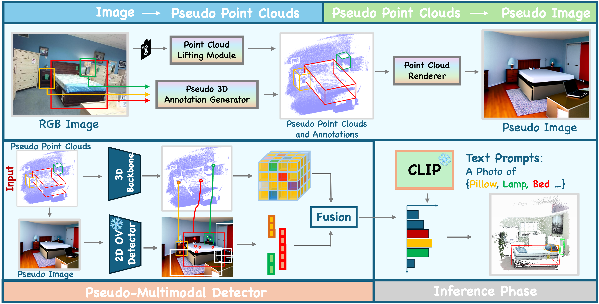

<h2 align="center">
   <b>【NeurIPS 2024 🇨🇦】ImOV3D: Learning Open Vocabulary Point Clouds 3D Object Detection from Only 2D Images</b>
</h2>

- We are the first to accomplish Open-Vocabulary 3D Object Detection tasks without using any 3D ground truth data. 
- Thank you for 🌟 our ImOV3D.


[](https://arxiv.org/pdf/2410.24001v1)
<!-- [](https://yangtiming.github.io/ImOV3D_Page/) -->

> [Timing Yang*](https://yangtiming.github.io/), [Yuanliang Ju*](https://x.com/averyjuuu0213), [Li Yi](https://ericyi.github.io/) <br>
> Shanghai Qi Zhi Institute, IIIS Tsinghua University, Shanghai AI Lab<br>


🕹️**To Do List**  

&#9744; The code and data will be released within one month. Please stay tuned.

&#9745; Our paper ImOV3D is released, check out it on [arXiv](https://arxiv.org/pdf/2410.24001v1).


## Overall Pipeline
 <p align="center">  </p>

## Main Results
 <p align="center">  </p>

## More Ablation Study and Visualization

<p align="center">  </p>
<p align="center">  </p>

## Contect
If you have any questions, please feel free to contact us:

Timing Yang: timingya@usc.edu
Yuanliang Ju: yuanliang.ju@mail.utoronto.ca

## Citation
```bibtex
@article{yang2024imov3d,
  title={ImOV3D: Learning Open-Vocabulary Point Clouds 3D Object Detection from Only 2D Images},
  author={Yang, Timing and Ju, Yuanliang and Yi, Li},
  journal={arXiv preprint arXiv:2410.24001},
  year={2024}
}
```

## Acknowledgments
Parts of this project page were adopted from the [Nerfies](https://nerfies.github.io/) page.

